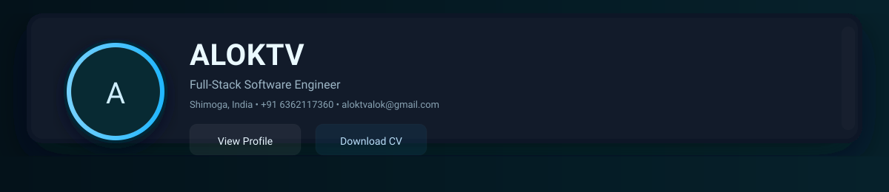
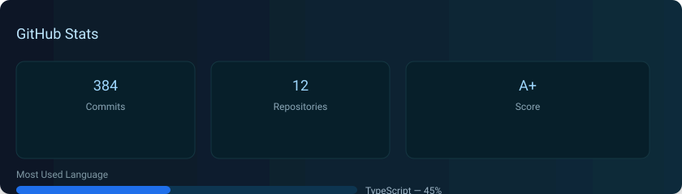
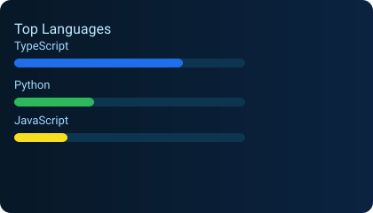
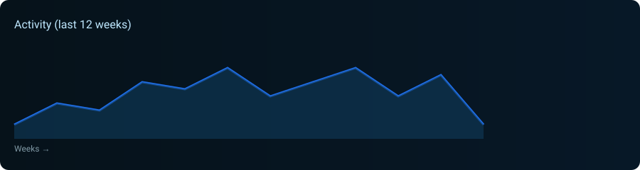

<!-- prettier-ignore -->

  

<h1 align="center">Hi, I'm Alok T 👋</h1>
<h3 align="center">Full-Stack Software Engineer | Backend Specialist | Problem Solver</h3>

  
  
  
  

  

---

## 🚀 About Me

I'm a **Full-Stack Software Engineer** with **4+ years** of hands-on experience building **scalable, production-grade systems**. I specialize in backend architecture, database optimization, and delivering high-impact solutions in fast-paced environments.

At **Chimple Learning**, I've led critical infrastructure projects including:
- 🔄 **Firebase → Supabase** migration (PostgreSQL) for enhanced scalability
- 🛡️ **Security & Access Control** using Row-Level Security (RLS)
- ⚡ **Automation & CI/CD** pipelines with GitHub Actions
- 📊 **Data Analytics** and A/B testing frameworks

**Location:** 📍 Shimoga, India | **Contact:** ☎ +91 6362117360

---

## 💻 Technical Expertise

### Backend & Databases

### Languages

### Tools & Infrastructure

---

## 💼 Professional Experience

### Software Engineer @ Chimple Learning (CUBA App)
**Bengaluru, India** | *2022 – Present* | *4+ years*

**Key Contributions:**
- 🔧 **Led Firebase → Supabase migration**, improving query performance by 40% and enabling complex relational operations
- 🏗️ **Architected scalable REST APIs** serving 50K+ monthly active users with optimized database queries
- 🔐 **Implemented Row-Level Security (RLS)** policies, ensuring data isolation and compliance
- 🤖 **Built Ops Mode automation** for bulk onboarding, reducing manual effort by **~90%**
- 📈 **Developed analytics pipeline** with GrowthBook & BigQuery for A/B testing and data-driven decisions
- ⚙️ **Established CI/CD workflows** using GitHub Actions, reducing deployment time by 50%
- 👥 **Mentored junior developers** on clean code practices, system design, and best practices

---

## 🎯 Featured Projects

### Automatic Textile Stain Detection
**Tech Stack:** Python, YOLOv5, OpenCV, Computer Vision

- Developed ML model for automated fabric defect detection in textile manufacturing
- Built end-to-end pipeline: data preprocessing → model training → inference
- Achieved **95%+ accuracy** on defect classification

### Job Search Dashboard
**Tech Stack:** Node.js, JavaScript, REST API, Express.js

- Aggregated job listings from multiple platforms with advanced filtering
- Designed modular backend architecture for seamless integration of new data sources
- Implemented real-time job alerts and user preferences storage

---

## 📊 GitHub Activity & Stats

  
  

  

---

## 🎓 Education

**Bachelor of Computer Applications (BCA)**  
S R Nagappa Shetty Memorial National College, Shivamogga | *2022*

---

## 🤝 Let's Connect!

I'm passionate about **scalable systems**, **clean code**, and **solving real-world problems**. Open to:
- 💬 Collaboration on exciting projects
- 📚 Knowledge sharing and mentoring
- 🚀 New opportunities and challenges

  <a href="mailto:aloktvalok@gmail.com"><strong>📧 Drop me a message</strong></a> • 
  <a href="https://www.linkedin.com/in/alok-tv-2301ba237"><strong>💼 Connect on LinkedIn</strong></a> • 
  <a href="https://github.com/ALOKTV/portfolio"><strong>🌐 View My Portfolio</strong></a>

---

  
Made with ❤️ by <a href="https://github.com/ALOKTV">Alok T</a>

  

    <a href="RESUME.md">📄 Full Resume</a> • 
    <a href="https://github.com/ALOKTV?tab=repositories">📁 All Repositories</a> • 
    <a href="https://github.com/ALOKTV?tab=stars">⭐ Starred Projects</a>
  

